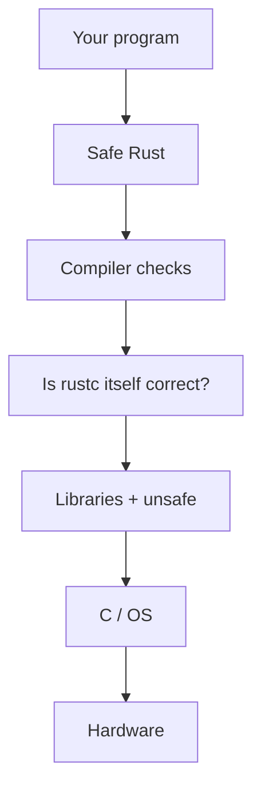

import Tabs from '@theme/Tabs';
import TabItem from '@theme/TabItem';
import Head from '@docusaurus/Head';

<Head>
  <meta name="description" content="Plain English: what 'Rust is memory safe' really means, what it does not cover, and a rustc bug with no unsafe keyword." />
</Head>

# Rust Claims, a Reality Check: Safety, Tools, and Systems Programming

:::note
Related: [Rust vs Modern C++](/docs/articles/rust-vs-modern-cpp-memory-safety-beyond-the-hype) · [How rustc compiles vs C++](/docs/articles/rustc-pipeline-vs-cpp-compilation-pipeline)
:::

People say **Rust is memory safe**. I wanted to know what that actually means. So I compiled small programs, looked at a real Rust project, and read a 2026 paper about bugs in rustc (the Rust compiler).

This is not “Rust is fake.” It is also not “Rust already fixed everything.” It is: the claim is real, but it is smaller than the short sentence on slides.

What follows is the **top of the iceberg**: a few programs, a sanitizer flag, one rewrite (uutils), one rustc paper. Under that sit file races, C FFI, `unsafe` in libraries, optimizer rules, and bugs **inside rustc**. Those do not show up on the slide. They still ship.

There are three different fights online. Do not mix them.

1. **Memory safety**: can the program smash memory?
2. **Tools**: is rustc slow? is the docs search bad?
3. **Systems work**: can you write a kernel, or only small apps?

Those are different questions.

## Table of Contents

- [The short answer](#the-short-answer)
- [Three levels of Rust safety](#three-levels-of-rust-safety)
- [What “memory safe” means here](#what-memory-safe-means-here)
- [The same bug in C, C++, and Rust](#the-same-bug-in-c-c-and-rust)
- [What Rust guarantees](#what-rust-guarantees)
- [Safety is not correctness](#safety-is-not-correctness)
- [What I compiled](#what-i-compiled)
- [C++23, sanitizers, Boost, crates](#c23-sanitizers-boost-crates)
- [The `unsafe` keyword](#the-unsafe-keyword)
- [Libraries and C code](#libraries-and-c-code)
- [A real CVE, two ways](#a-real-cve-two-ways)
- [The compiler can also be wrong](#the-compiler-can-also-be-wrong)
- [A 2026 research paper](#a-2026-research-paper)
- [Bug #25860, which I compiled](#bug-25860-which-i-compiled)
- [What you pay for the checks](#what-you-pay-for-the-checks)
- [Would I pick Rust?](#would-i-pick-rust)
- [Limits](#limits)
- [References](#references)

## The short answer

**Safe Rust** (code with no `unsafe` keyword) really does stop many memory bugs that C and C++ still allow. C and C++ can catch some of the same bugs with [AddressSanitizer](https://github.com/google/sanitizers/wiki/AddressSanitizer) / [UBSan](https://clang.llvm.org/docs/UndefinedBehaviorSanitizer.html). Those flags are extra. rustc’s check on the examples below is the default.

The argument I hear is real:

- C and C++ still have memory bugs
- so they need a **stricter compiler**, or **language features** that make those bugs harder to type

What each side actually offers:

- **Rust:** both. Language rules cover two things rustc checks by **default**:
  - **borrow checking**: who owns this memory, and whether a pointer to it is still valid
  - **index checking**: the array has 4 slots; writing slot 10 is an error
- **C++:** 
      - language features you can pick: [`std::unique_ptr`](https://en.cppreference.com/w/cpp/memory/unique_ptr), [`std::span`](https://en.cppreference.com/w/cpp/container/span), [`vector::at`](https://en.cppreference.com/w/cpp/container/vector/at). 
      - Plus a stricter compiler you can turn on: [ASan](https://github.com/google/sanitizers/wiki/AddressSanitizer) / [UBSan](https://clang.llvm.org/docs/UndefinedBehaviorSanitizer.html).

:::tip **The catch is the default.** 
In `C` and `C++`, writing beyond the length of an array can still compile, but it may cause a `memory bug at runtime`.

In `Rust`, the `compiler` usually catches this during `compilation time` ,hence the program can be `safe during runtme`.
:::

A stricter compiler and new types do not delete human error. They move it. Split who is typing:

- **C/C++ app developer**: the safer types exist, but they do not have to use them. They can still:
  - index with `v[i]` instead of `v.at(i)` (no check)
  - use `new` / `delete` instead of `unique_ptr` (easy to free too soon)
  - `free(p)` then `printf("%s", p)` (use memory after it is gone)
  - write `a[10]` on an array of size 4 (past the end)
- **Rust app developer**: can write [`unsafe`](https://doc.rust-lang.org/book/ch19-01-unsafe-rust.html), lie to the type system, or pass a bad length into C
- **gcc / g++ / clang developer**: can miss a warning, ship bad codegen, or an optimizer bug
- **rustc developer**: can ship a [soundness bug](https://conf.researchr.org/details/issta-2026/issta-2026-research-papers/129/Rust-s-Type-Checker-Implementation-is-Unsound-An-Empirical-Study-on-Soundness-Bugs-i) (accept code they should reject)

Same species. Features only help if the app developer uses the safe default (Rust) or the safe API (C++ `v.at(i)`, not `v[i]`).

The useful question is not who is smarter. It is **what each language gives you to find the mess**:

- default rustc: language rules on
- default gcc / g++ / clang: those rules off
- C++ features you choose: `at()`, `span`, smart pointers
- sanitizers: if you pass the flag and run that path
- [Miri](https://github.com/rust-lang/miri): after rustc already said ok, for rustc holes

Let’s look at examples I compiled with rustc 1.93.1, gcc/g++ 13.3, and **clang/clang++ 18.1.3**. Full output is in [What I compiled](#what-i-compiled) and [C++23, sanitizers, Boost, crates](#c23-sanitizers-boost-crates).

**Example 1.** This function makes a `String` on the stack, then tries to hand a pointer to it back to the caller:

```rust
fn dangling() -> &'static str {
    let s = String::from("secret");
    &s
}
```

What it is doing: `s` lives only while `dangling` is running. When the function returns, `s` is destroyed. `&s` is a pointer into that dead memory. If rustc allowed this, the caller would read bytes that no longer belong to the program.

What rustc did (default, no extra flag):

```text
error[E0515]: cannot return reference to local variable `s`
 --> uaf.rs:3:5
  |
3 |     &s
  |     ^^ returns a reference to data owned by the current function
```

No binary. That reject is the good outcome.

In C you can `free(p)` then `printf("%s", p)`: gcc warns `-Wuse-after-free` and still links. **clang 18.1.3** with `-Wall -Wextra` said **nothing** and still linked. In C++ you can keep a `string_view` after `delete`: g++ 13.3 and clang++ 18 both said nothing and still linked. Those programs can crash, print garbage, or read data an attacker put in the reused heap.

Same C, with a sanitizer:

```text
$ gcc -O0 -Wall -Wextra -fsanitize=address uaf.c -o uaf_c_asan
$ ./uaf_c_asan
ERROR: AddressSanitizer: heap-use-after-free
SUMMARY: AddressSanitizer: heap-use-after-free ... in printf_common
# abort, exit 1

$ clang -O0 -Wall -Wextra -fsanitize=address uaf.c -o uaf_clang_asan
$ ./uaf_clang_asan
ERROR: AddressSanitizer: heap-use-after-free
SUMMARY: AddressSanitizer: heap-use-after-free ... in printf_common
```

C++ `string_view` after `delete`, ASan: `heap-use-after-free` in `fwrite`, abort. So yes: **a sanitizer can report the same class of bug Rust refused.** You had to rebuild with `-fsanitize=address` and actually run `main`. rustc never let a binary out.

**Example 2.** This program makes an array of four zeros, then writes index 10:

```rust
fn main() {
    let mut a = [0; 4];
    a[10] = 42;
}
```

What it is doing: valid indexes are 0, 1, 2, 3. Index 10 is six slots past the end. In C and C++ that write is undefined behavior: smash the stack, overwrite a return address, or look fine until it does not. gcc and g++ 13.3 with `-Wall -Wextra` built it with **no diagnostic**. clang and clang++ 18 warned `-Warray-bounds` and **still linked**.

What rustc did (default):

```text
error: this operation will panic at runtime
 --> oob.rs:3:5
  |
3 |     a[10] = 42;
  |     ^^^^^ index out of bounds: the length is 4 but the index is 10
  |
  = note: `#[deny(unconditional_panic)]` on by default
```

No binary.

Same C with UBSan (ASan alone did not print a clean stack-overflow report on this tiny `int a[4]` in my run; UBSan did):

```text
$ gcc -O0 -Wall -Wextra -fsanitize=undefined oob.c -o oob_ubsan
$ ./oob_ubsan
oob.c:3:6: runtime error: index 10 out of bounds for type 'int [4]'

$ clang -O0 -Wall -Wextra -fsanitize=undefined oob.c -o oob_clang_ubsan
# also -Warray-bounds at compile time, then:
oob.c:3:5: runtime error: index 10 out of bounds for type 'int[4]'
```

Again: the sanitizer can name the same bug. Default gcc still shipped a binary. Default rustc did not.

**Example 3.** Constant `a[10]` is the easy case. rustc can see the number. Now `i` comes from the command line, so the compiler cannot reject it up front.

```rust
fn main() {
    let mut a = [0i32; 4];
    let i: usize = std::env::args()
        .nth(1)
        .and_then(|s| s.parse().ok())
        .unwrap_or(10);
    a[i] = 42;
    println!("still running, a[0]={}", a[0]);
}
```

What it is doing: same four-slot array. The index is not in the source as `10`. rustc **accepts** this. You get a binary. The language still gives you a check: at run time.

```text
$ rustc slice_i.rs -o slice_i_rs    # exit 0
$ ./slice_i_rs 4
thread 'main' panicked at slice_i.rs:7:5:
index out of bounds: the len is 4 but the index is 4
# exit 101: never prints "still running"
```

Same with `rustc -O`. Bounds checks stay in. Valid index `0` prints `still running, a[0]=42`.

The C side, same idea: `i` from argv, array of 4, a neighbor `flag` sitting right after it:

```c
struct Box {
    int a[4];
    int flag;
};
int i = atoi(argv[1]);   /* we passed 4 */
b.a[i] = 42;
printf("still running  a[0]=%d  flag=%d\n", b.a[0], b.flag);
```

```text
$ gcc -O0 -Wall -Wextra slice_i.c -o slice_i_c    # exit 0, no warning
$ ./slice_i_c 4
still running  a[0]=0  flag=42
# exit 0

$ clang -O0 -Wall -Wextra slice_i.c -o slice_i_clang
$ ./slice_i_clang 4
still running  a[0]=0  flag=42
# exit 0: same smash
```

`flag` started as `7`. After `a[4] = 42` it is `42`. The program kept going. That is the unsafe failure.

Now the sanitizer: this is the honest part. ASan + UBSan, **defaults**:

```text
$ gcc -O0 -Wall -Wextra -fsanitize=address,undefined slice_i.c -o slice_i_san
$ ./slice_i_san 4
slice_i.c:12:8: runtime error: index 4 out of bounds for type 'int [4]'
still running  a[0]=0  flag=42
# exit 0

$ clang -O0 -Wall -Wextra -fsanitize=address,undefined slice_i.c -o slice_i_clang_san
$ ./slice_i_clang_san 4
slice_i.c:12:5: runtime error: index 4 out of bounds for type 'int[4]'
SUMMARY: UndefinedBehaviorSanitizer: undefined-behavior ...
still running  a[0]=0  flag=42
# exit 0
```

UBSan **printed** the same “index out of bounds” story Rust panics with. Then the program **kept running** and `flag` was still smashed. Default UBSan recovers. ASan did not stop this one: `a[4]` is the next field in the same `struct`, an intra-object overflow sanitizers often miss.

If I add `-fno-sanitize-recover=undefined`, UBSan aborts and does not print `still running`. That flag is extra, like ASan is extra. Rust’s panic on `a[i]` needed no extra flag.

**What each side actually gives you**

| Where the human erred | What C/C++ gave me | What Rust gave me |
|---|---|---|
| Safe-looking UAF / constant overflow | Binary, unless I add ASan/UBSan and run that path | rustc error, no binary |
| Runtime `a[i]` too big | Default: smash and continue. Sanitizer: maybe a message; maybe still continue; maybe miss | Panic, default, debug and `-O` |
| `unsafe` / FFI / “trust me” | Same as C: you are on your own | rustc trusts you. [Miri](https://github.com/rust-lang/miri) can check **if** you run it |
| rustc itself wrong | (n/a) | ISSTA 2026: rustc accepted code it should reject. Miri after the fact |

So: sanitizers can report what Rust reports. They are a tool you turn on. Safe Rust is a default. That is the real difference, not “Rust programmers never err.” They do. `unsafe` is that err. The language still marks the hole (`unsafe`) and still panics in the safe subset. C does not mark `a[i] = 42` as unsafe, and the default `a[i]` does not panic.

Rust does **not** magically stop:

- logic bugs (the program does the wrong thing)
- file races (check a path, then someone changes the file)
- mistakes when talking to C
- bugs **inside rustc itself**

A 2026 ISSTA paper, [Rust's Type Checker Implementation is Unsound](https://conf.researchr.org/details/issta-2026/issta-2026-research-papers/129/Rust-s-Type-Checker-Implementation-is-Unsound-An-Empirical-Study-on-Soundness-Bugs-i) (Sim, Ryu, Hong; artifact on [Zenodo](https://doi.org/10.5281/zenodo.20698055)), counted rustc bugs where the compiler said “ok” to code it should have rejected. [Miri](https://github.com/rust-lang/miri) (a Rust checker) can catch some of those **after** rustc already accepted the code. That is Rust’s sanitizer-shaped answer for compiler holes: opt-in, after compile.

Big companies use Rust because it moves one class of bugs to compile time. That is useful. The compiler is still software. Software has bugs.

## Three levels of Rust safety

The slide says “Rust.” That is three different products glued together.

**Level 1: safe Rust.** No `unsafe` in *your* function. rustc checks who owns the memory, how long a pointer is valid, and (for `a[i]`) whether the index fits. That is the claim people mean.

**Level 2: `unsafe`.** You told rustc to trust you. The type still looks safe to callers. The proof is now a human.

**Level 3: FFI + the toolchain.** C libraries, ABI, file descriptors, `mmap`, rustc itself, LLVM. The language rules stop at the `extern "C"` door. They also stop if rustc is wrong.

```text
             Rust safety
                  |
       +----------+----------+
       |          |          |
   Safe Rust    unsafe    FFI / toolchain
       |          |          |
  ownership    you hold    C, ABI,
  borrowing    the proof   rustc, LLVM
  index checks
```

The rest of this article is that picture filled in with programs.

## What “memory safe” means here

**Memory safety** means: the program only reads and writes memory it is allowed to use, and only while that memory is still alive. Two threads should not write the same memory at the same time with no lock.

It does **not** mean “the program is correct.” A program can be memory-safe and still delete the wrong file.

Simple names:

| Name | Plain meaning |
|---|---|
| Use-after-free (UAF) | Use memory after you freed it |
| Buffer overflow | Write past the end of an array |
| Double free | Free the same memory twice |
| Data race | Two threads touch the same memory in a bad way |
| Null | Use a pointer that is empty |
| Uninit | Read memory you never set |
| TOCTOU | Check a file, then it changes before you use it |
| FFI | Rust calling C (or C calling Rust) |
| Soundness bug | The compiler accepts code it should reject |

| Kind of bug | Safe Rust | `unsafe` or C FFI | C / C++ |
|---|---|---|---|
| UAF, overflow, double-free, data race, null, uninit | Usually stopped | Possible | Possible |
| Integer wrap (numbers too big) | Debug: panic. Release: wrap. Not the same as C “undefined” smash | Same | Often dangerous |
| TOCTOU, logic bugs, out of memory | Not stopped | Not stopped | Not stopped |
| Bad C API / compiler bug | Not stopped | Possible | Possible |

If you write `slice[i]` and `i` is too big, **safe Rust panics** (the program stops). That is the *safe* failure. In C the same index often corrupts memory and keeps running. [Example 3](#the-short-answer) is that test: Rust `./slice_i_rs 4` panics (exit 101). gcc `./slice_i_c 4` prints `still running` and `flag` changed from 7 to 42.

One table for the experiments above (safe Rust, **default** C/C++ build, no sanitizer):

| Bug / property | C | C++ | Safe Rust |
|---|---|---|---|
| Out-of-bounds **constant** index (`a[10]` on size 4) | Compiles (gcc silent; clang warns, still links) | Compiles | Compile error |
| Out-of-bounds **runtime** index | Undefined behavior; my run smashed a neighbor `flag` | Same with `span[i]` | Panic; process stops |
| Use-after-free | Possible; gcc may warn | Possible; `string_view` was silent | Ownership: no binary |
| Data race | Possible | Possible | Prevented in safe code |
| Null dereference | Possible | Possible | `Option` / references, not raw null |
| Manual `free` / `delete` | Yes | Yes | Usually unnecessary (`Box` / `Vec` drop it) |

That is the takeaway. Sanitizers and `vector::at` move C++ closer to the right-hand column. They are not the default.

## The same bug in C, C++, and Rust

One hole, three spellings. Allocate an `int`, free it, write through the old pointer.

<Tabs groupId="same-uaf">
  <TabItem value="c" label="C: still a binary">

```c
int *p = malloc(sizeof(int));
free(p);
*p = 42;   /* gcc: -Wuse-after-free, then links */
```

  </TabItem>
  <TabItem value="cxx" label="C++: still a binary">

```cpp
int *p = new int;
delete p;
*p = 42;   /* g++ / clang++: still a program */
```

  </TabItem>
  <TabItem value="rs" label="Rust: E0382">

```rust
fn main() {
    let mut p = Box::new(10);
    drop(p);
    *p = 42;
}
```

```text
$ rustc drop.rs
error[E0382]: use of moved value: `p`
 --> drop.rs:4:5
  |
2 |     let mut p = Box::new(10);
  |         ----- move occurs because `p` has type `Box<i32>`
3 |     drop(p);
  |          - value moved here
4 |     *p = 42;
  |     ^^^^^^^ value used here after move
```

  </TabItem>
</Tabs>

**Why rustc rejects this**, not “because Rust is safer” as a slogan. `Box` **owns** the heap `i32`. `drop(p)` **moves** that owner into `drop`. After the move, `p` is gone. There is no pointer left to write. C `free(p)` only marks the heap free; the **variable** `p` is still a number you can store through. That is the language rule, not a smarter programmer.

The longer `String` / `string_view` demos in [What I compiled](#what-i-compiled) are the same rule with more bytes.

## What Rust guarantees

Rust’s memory-safety claim applies to **safe Rust**, if rustc is sound, and if you did not smuggle a lie through `unsafe` or C. It does **not** mean every Rust program is free of bugs.

**Safe Rust is built to stop**

- use-after-free, double-free, dangling references
- out-of-bounds access (compile error if rustc can see it; panic if `i` is a variable)
- data races (two threads, same memory, no lock, at least one write)
- using `null` as a value: you use `Option` instead

**Safe Rust does not automatically stop**

- logic bugs (wrong algorithm, wrong result)
- races that are **not** data races (TOCTOU, check-then-act on a path)
- wrong permissions, bad input, denial of service (panic / OOM still “stops,” still a bug)
- wrong FFI contracts
- bugs **inside** `unsafe`
- bugs in rustc or LLVM

## Safety is not correctness

```text
Memory safe
    |
    v
No use-after-free
No dangling pointer
No out-of-bounds write in safe code
    |
    v
BUT the program can still
    |
    v
wrong algorithm
wrong file / permissions
wrong protocol
TOCTOU
ignored Result
DoS (panic loop, OOM)
```

uutils is that picture in production: overflow and UAF got much harder. File races, `.ok()`, and C wrappers remained. Memory safety is a floor. It is not the building.

I used to think “the borrow checker is the whole story.” Then I searched a real crate for `unsafe`. The hole can be in your `unsafe` block, in a library, in C, or in rustc. The layer above can still look fine.



## What I compiled

Same computer. **rustc 1.93.1** (`01f6ddf75`, 2026-02-11). **gcc/g++ 13.3.0**. **clang/clang++ 18.1.3**. Flags: `-Wall -Wextra` for C and C++. No AddressSanitizer unless I say so. Commands:

```bash
gcc    -Wall -Wextra uaf.c  -o uaf_c       # exit 0, warns -Wuse-after-free
clang  -Wall -Wextra uaf.c  -o uaf_clang   # exit 0, no warning
g++    -std=c++20 -Wall -Wextra uaf.cpp -o uaf_cpp      # exit 0, silent
clang++ -std=c++20 -Wall -Wextra uaf.cpp -o uaf_clangpp # exit 0, silent
rustc uaf.rs -o uaf_rs                     # error, no binary

gcc    -Wall -Wextra oob.c  -o oob_c       # exit 0, no diagnostic
clang  -Wall -Wextra oob.c  -o oob_clang   # exit 0, -Warray-bounds, still a binary
rustc oob.rs -o oob_rs                     # error, no binary

clang -O0 -Wall -Wextra slice_i.c -o slice_i_clang
./slice_i_clang 4                          # still running, flag smashed
```

### 1. Use memory after free

<Tabs groupId="exp-uaf">
  <TabItem value="c" label="C: still builds">

```c
#include <stdio.h>
#include <stdlib.h>
int main(void) {
    char *p = malloc(32);
    if (!p) return 1;
    free(p);
    printf("%s", p);
    return 0;
}
```

```text
$ gcc -Wall -Wextra uaf.c -o uaf_c
uaf.c: In function ‘main’:
uaf.c:7:5: warning: pointer ‘p’ used after ‘free’ [-Wuse-after-free]
    7 |     printf("%s", p);
      |     ^~~~~~~~~~~~~~~
uaf.c:6:5: note: call to ‘free’ here
    6 |     free(p);
      |     ^~~~~~~
# exit code 0: you still get a binary
```

```text
$ clang -Wall -Wextra uaf.c -o uaf_clang
# no diagnostic
# exit code 0
```

**Why that is bad.** `free` gave the heap block back. `printf` still reads it. The bytes may be garbage, may crash, or may be data an attacker put there after reuse. gcc saw the bug and **still linked**. clang 18 with `-Wall -Wextra` did not even warn. A warning is not a stop.

  </TabItem>
  <TabItem value="cxx" label="C++: no warning">

```cpp
#include <iostream>
#include <string>
int main() {
    auto* s = new std::string("secret");
    std::string_view v = *s;
    delete s;
    std::cout << v << "\n";
}
```

```text
$ g++ -std=c++20 -Wall -Wextra uaf.cpp -o uaf_cpp
$ clang++ -std=c++20 -Wall -Wextra uaf.cpp -o uaf_clangpp
# both: no output, exit 0, binary produced
```

**Why that is bad.** `string_view` is only a pointer plus length. After `delete s`, those bytes are dead. Printing `v` is use-after-free. g++ 13.3 and clang++ 18 did not even warn. You can ship this.

  </TabItem>
  <TabItem value="rs" label="Rust: no binary">

```rust
fn dangling() -> &'static str {
    let s = String::from("secret");
    &s
}
fn main() { println!("{}", dangling()); }
```

```text
$ rustc uaf.rs -o uaf_rs
error[E0515]: cannot return reference to local variable `s`
 --> uaf.rs:3:5
  |
3 |     &s
  |     ^^ returns a reference to data owned by the current function

error: aborting due to 1 previous error
```

**What rustc did.** `s` dies at the end of `dangling`. The `&s` would point at dead memory. rustc refused. **No object file, no binary.**

**Why that reject is good.** You cannot run this program. You cannot put it in a release. The same class of bug that gcc warned-and-linked, clang silently linked, and g++/clang++ silently linked, never leaves rustc. That is the memory-safety claim in one command.

  </TabItem>
</Tabs>

What surprised me was C++, not Rust. g++ and clang++ made a binary and said nothing. gcc at least warned, then still linked. clang 18 did not warn on the `free` then `printf` case. Tools like AddressSanitizer can catch the C/C++ bugs **if you turn them on**. I did not turn them on for the default builds. The slogan is about the normal build, not the special test build.

### 2. Write past the array

<Tabs groupId="exp-oob">
  <TabItem value="c" label="C: still builds">

```c
int main(void) {
    int a[4] = {0};
    a[10] = 42;
    return a[10];
}
```

```text
$ gcc -Wall -Wextra oob.c -o oob_c
# no diagnostic
# exit code 0

$ clang -Wall -Wextra oob.c -o oob_clang
oob.c:3:5: warning: array index 10 is past the end of the array (that has type 'int[4]') [-Warray-bounds]
    3 |     a[10] = 42;
      |     ^ ~~
# exit code 0: you still get a binary
```

**Why that is bad.** The array has four `int`s. Index 10 is six slots past the end. In C that is undefined behavior: smash the stack, overwrite a return address, or “work” until it does not. gcc 13.3 with `-Wall -Wextra` still built it with no warning. clang 18 warned, then **still linked**. rustc refused.

  </TabItem>
  <TabItem value="cxx" label="C++: still builds">

```cpp
int main() {
    int a[4] = {0};
    a[10] = 42;
    return a[10];
}
```

```text
$ g++ -std=c++20 -Wall -Wextra oob.cpp -o oob_cpp
# no diagnostic, exit 0

$ clang++ -std=c++20 -Wall -Wextra oob.cpp -o oob_clangpp
# -Warray-bounds, exit 0, binary produced
```

**Why that is bad.** Same write. Same undefined behavior. gcc silent. clang warns. Both ship a binary.

  </TabItem>
  <TabItem value="rs" label="Rust: no binary">

```rust
fn main() {
    let mut a = [0; 4];
    a[10] = 42;
}
```

```text
$ rustc oob.rs -o oob_rs
warning: value assigned to `a` is never read
 --> oob.rs:3:5
  |
3 |     a[10] = 42;
  |     ^^^^^^^^^^

error: this operation will panic at runtime
 --> oob.rs:3:5
  |
3 |     a[10] = 42;
  |     ^^^^^ index out of bounds: the length is 4 but the index is 10
  |
  = note: `#[deny(unconditional_panic)]` on by default

error: aborting due to 1 previous error; 1 warning emitted
```

**What rustc did.** It saw length 4 and index 10 in the source. That write would always panic. The default `deny(unconditional_panic)` turns that into a **hard error**. Again: no binary.

**Why that reject is good.** You never get a program that writes off the end of the array. In C that write can corrupt memory and keep running. rustc stops the constant case at compile time.

  </TabItem>
</Tabs>

### 3. Variable index (`slice[i]`)

rustc cannot reject this at compile time: `i` comes from `argv`. Full programs:

<Tabs groupId="exp-slice-i">
  <TabItem value="c" label="C: builds, keeps running">

```c
#include <stdio.h>
#include <stdlib.h>
struct Box {
    int a[4];
    int flag;
};
int main(int argc, char **argv) {
    struct Box b;
    b.a[0] = b.a[1] = b.a[2] = b.a[3] = 0;
    b.flag = 7;
    int i = argc > 1 ? atoi(argv[1]) : 4;
    b.a[i] = 42;
    printf("still running  a[0]=%d  flag=%d\n", b.a[0], b.flag);
    return 0;
}
```

```text
$ gcc -O0 -Wall -Wextra slice_i.c -o slice_i_c
# no diagnostic, exit 0
$ ./slice_i_c 4
still running  a[0]=0  flag=42
# exit 0
```

**Why that is bad.** Valid indexes of `a` are 0..3. Index 4 is the next `int`, which is `flag`. gcc wrote 42 into `flag` and continued. A bigger `i` (I tried 10) hit a segfault (exit 139). Either way: undefined behavior. The “lucky” case is the scary one: the program looks alive while it has already corrupted memory.

  </TabItem>
  <TabItem value="rs" label="Rust: builds, then panics">

```rust
fn main() {
    let mut a = [0i32; 4];
    let i: usize = std::env::args()
        .nth(1)
        .and_then(|s| s.parse().ok())
        .unwrap_or(10);
    a[i] = 42;
    println!("still running, a[0]={}", a[0]);
}
```

```text
$ rustc slice_i.rs -o slice_i_rs
# exit 0: unlike a[10] in the source, this is allowed
$ ./slice_i_rs 4
thread 'main' panicked at slice_i.rs:7:5:
index out of bounds: the len is 4 but the index is 4
# exit 101
```

`rustc -O` panicked the same way. `./slice_i_rs 0` prints `still running, a[0]=42`.

**What rustc did.** It could not prove `i` was in range, so it compiled a bounds check. At run time the check failed. The process stopped. It never printed `still running`.

**Why that panic is good.** Some people call it a crash. It is the *safe* failure: no write past the array, no smashed `flag`. I would rather have a panic than silent corruption.

  </TabItem>
</Tabs>

### 4. File race (TOCTOU)

You check a file path. Then someone swaps the file. Then you open the path. The compiler does not see that. That bug has a name: [TOCTOU](https://en.wikipedia.org/wiki/Time-of-check_to_time-of-use) (time-of-check to time-of-use). Rust [`std::fs`](https://doc.rust-lang.org/std/fs/) takes paths, like many C programs. Two syscalls on the same path string are two lookups. The file can change in between.

Let’s look at a small program I compiled. It is the same shape as the CVEs, squeezed into one process so the window is visible. **Check** the path. **Swap** the file behind that name. **Use** the same path. rustc and gcc both accept it. ASan does not save you: this is not a memory smash.

**What it is doing.** Write `target` with `hello`. Write `other` with `secret`. Call `metadata` / `stat` on `target` (the check). Replace `target` with `other`. Open `target` and read (the use). The check saw `hello`. The read got `secret`.

<Tabs groupId="exp-toctou">
  <TabItem value="rs" label="Rust: builds, reads secret">

```rust
use std::fs::{self, File};
use std::io::Read;

fn main() {
    let dir = std::env::temp_dir().join("cs_toctou_rs");
    let _ = fs::remove_dir_all(&dir);
    fs::create_dir_all(&dir).unwrap();
    let path = dir.join("target");
    let other = dir.join("other");
    fs::write(&path, b"hello\n").unwrap();
    fs::write(&other, b"secret\n").unwrap();

    let meta = fs::metadata(&path).unwrap();
    println!("check: is_file={} size={}", meta.is_file(), meta.len());

    fs::remove_file(&path).unwrap();
    fs::rename(&other, &path).unwrap();

    let mut s = String::new();
    File::open(&path).unwrap().read_to_string(&mut s).unwrap();
    println!("use: read {:?}", s.trim());
}
```

```text
$ rustc toctou.rs -o toctou_rs
# exit 0: no error. The borrow checker does not see files.
$ ./toctou_rs
check: is_file=true size=6
use: read "secret"
# exit 0
```

**Why rustc is silent.** `path` is a string. Both calls are legal. Nothing was freed. No index was out of range. The bug is two lookups of one name.

  </TabItem>
  <TabItem value="c" label="C: same bug, same output">

```c
struct stat st;
stat(path, &st);                 /* check */
printf("check: is_reg=%d size=%ld\n", S_ISREG(st.st_mode), (long)st.st_size);

unlink(path);
rename(other, path);             /* swap */

f = fopen(path, "r");            /* use */
fgets(buf, sizeof buf, f);
printf("use: read \"%s\"\n", buf);
```

```text
$ gcc -Wall -Wextra toctou.c -o toctou_c
# exit 0
$ ./toctou_c
check: is_reg=1 size=6
use: read "secret"
# exit 0

$ gcc -O0 -Wall -Wextra -fsanitize=address toctou.c -o toctou_c_asan
$ ASAN_OPTIONS=detect_leaks=0 ./toctou_c_asan
check: is_reg=1 size=6
use: read "secret"
# exit 0: ASan has nothing to say

$ clang -Wall -Wextra toctou.c -o toctou_clang
$ ./toctou_clang
check: is_reg=1 size=6
use: read "secret"
$ clang -O0 -Wall -Wextra -fsanitize=address toctou.c -o toctou_clang_asan
$ ASAN_OPTIONS=detect_leaks=0 ./toctou_clang_asan
check: is_reg=1 size=6
use: read "secret"
# exit 0
```

  </TabItem>
</Tabs>

In the real world the swap is another process in the gap between check and use, not `rename` in the same `main`. Same hole. The fix is not a smarter rustc. It is: open **once**, then `fstat` / operate on the **file descriptor**, or `O_NOFOLLOW`, so the name is not looked up twice.

Canonical paid [Zellic](https://github.com/Zellic/publications) to audit Ubuntu’s Rust coreutils ([uutils](https://github.com/uutils/coreutils)). Write-up: [An update on rust-coreutils](https://discourse.ubuntu.com/t/an-update-on-rust-coreutils/80773) (22 Apr 2026). Report: [uutils coreutils: Zellic Audit Report](https://github.com/Zellic/publications/blob/master/uutils%20coreutils%20-%20Zellic%20Audit%20Report.pdf). CVE list: [oss-security](https://www.openwall.com/lists/oss-security/2026/05/02/2). Example: [CVE-2026-35359](https://www.openwall.com/lists/oss-security/2026/05/02/2): `cp` checks a path, then opens it without `O_NOFOLLOW`; an attacker can swap in a symlink. Ubuntu 26.04 still ships GNU `cp` / `mv` / `rm` because those races were still open.

GNU coreutils still has **memory** bugs too. [CVE-2026-56392](https://osv.dev/vulnerability/CVE-2026-56392) (`unexpand`): integer wrap when sizing a buffer, then a heap overflow. [CERT Polska](https://cert.pl/en/posts/2026/07/CVE-2026-56391/) also lists [CVE-2026-56391](https://cert.pl/en/posts/2026/07/CVE-2026-56391/) (out-of-bounds read). So: uutils got TOCTOU CVEs; GNU still got overflow CVEs. Different class, both real. My test above is the TOCTOU class: rustc green, ASan green, wrong file.

### 5. Talking to C

When Rust calls C (`extern "C"`), rustc trusts the C side. That is [FFI](https://doc.rust-lang.org/nomicon/ffi.html) (foreign function interface). The language rules: [external blocks](https://doc.rust-lang.org/reference/items/external-blocks.html). Wrong length. A null pointer that the C docs call “success.” A memory map that another process shrinks. That is not the borrow checker failing. That is a contract with C. If you then do `from_raw_parts(ptr, len)`, rustc never measured `len`.

If a talk only shows tests 1 and 2, they showed the *compile-time* claim. Test 3 is the *run-time* panic. Tests 4 and 5 are the rest of the story.

People also point at “out of memory, process dies” or “program panics” and say Rust is not safe. Read the [panic docs](https://doc.rust-lang.org/book/ch09-01-unrecoverable-errors-with-panic.html). A panic unwinds or aborts. Allocation failure calls [`handle_alloc_error`](https://doc.rust-lang.org/std/alloc/fn.handle_alloc_error.html) (usually abort). Those are still bugs. They are not [`strcpy`](https://en.cppreference.com/w/c/string/byte/strcpy) past a buffer. `strcpy` is [undefined behavior](https://en.cppreference.com/w/c/language/behavior): the program may keep running on smashed memory. Panic stops. Different class. The [Rust reference](https://doc.rust-lang.org/reference/behavior-considered-undefined.html) lists what counts as UB in unsafe code. Safe indexing is not on that list; it panics instead.

## C++23, sanitizers, Boost, crates

The first tests used C arrays and `new`/`delete`. That is a fair “default C++ still lets you” demo. It is not a fair “C++ has no tools” demo. So I ran the same bugs again with **C++23**, **std::span**, **std::vector**, and [AddressSanitizer](https://github.com/google/sanitizers/wiki/AddressSanitizer). Compilers: **g++ 13.3** and **clang++ 18.1.3**, `-std=c++23`. Rust: **rustc 1.93.1**.

**What C++23 did not change.** `std::span` is a pointer plus a length, like a Rust slice type, but `span[i]` does **not** check `i` in the default operator. I compiled this:

```cpp
#include <iostream>
#include <span>
#include <vector>
int main(int argc, char** argv) {
    std::vector<int> v{0, 0, 0, 0};
    std::span<int> s = v;
    int i = argc > 1 ? std::stoi(argv[1]) : 4;
    s[i] = 42;
    std::cout << "still running  s[0]=" << s[0] << "\n";
}
```

```text
$ g++ -std=c++23 -O0 -Wall -Wextra cxx23_span.cpp -o cxx23_span
$ clang++ -std=c++23 -O0 -Wall -Wextra cxx23_span.cpp -o cxx23_span_clang
# both: exit 0, no warning
$ ./cxx23_span 4
still running  s[0]=0
$ ./cxx23_span_clang 4
still running  s[0]=0 v.size()=4
# exit 0
```

New standard. Same silent write past the vector. C++23 is not a borrow checker.

**What a sanitizer did change.** Same source, extra flag:

```text
$ g++ -std=c++23 -O0 -Wall -Wextra -fsanitize=address cxx23_span.cpp -o cxx23_span_asan
$ ./cxx23_span_asan 4
ERROR: AddressSanitizer: heap-buffer-overflow
WRITE of size 4
SUMMARY: AddressSanitizer: heap-buffer-overflow ... in main
# abort, exit 1

$ clang++ -std=c++23 -O0 -Wall -Wextra -fsanitize=address cxx23_span.cpp -o cxx23_span_clang_asan
$ ./cxx23_span_clang_asan 4
ERROR: AddressSanitizer: heap-buffer-overflow
SUMMARY: AddressSanitizer: heap-buffer-overflow ... in main
```

The `string_view` after `delete` program from test 1, still C++23:

```text
$ g++ -std=c++23 -O0 -Wall -Wextra cxx23_uaf.cpp -o cxx23_uaf
$ ./cxx23_uaf
secret
# exit 0: printed freed memory

$ g++ -std=c++23 -O0 -Wall -Wextra -fsanitize=address cxx23_uaf.cpp -o cxx23_uaf_asan
$ ./cxx23_uaf_asan
ERROR: AddressSanitizer: heap-use-after-free
SUMMARY: AddressSanitizer: heap-use-after-free ... fwrite
# abort, exit 1
```

So: **C++23 + ASan caught both bugs at run time.** That is real. It is also optional. You must pass `-fsanitize=address`, take the slowdown, and **run the path**. ASan does not run on code you never execute. rustc’s check on `&s` and on `a[10]` happens at compile time with no extra flag. The variable-index panic happens on every run of that binary, debug or `-O`.

**C++ already has a panic-shaped API.** [`std::vector::at`](https://en.cppreference.com/w/cpp/container/vector/at) throws:

```cpp
v.at(i) = 42;   // i == 4
```

```text
$ g++ -std=c++23 -O0 -Wall -Wextra cxx23_at.cpp -o cxx23_at
$ ./cxx23_at 4
terminate called after throwing an instance of 'std::out_of_range'
  what():  vector::_M_range_check: __n (which is 4) >= this->size() (which is 4)
# abort
```

That is closer to Rust `v[i]`. The catch: the **usual** C++ index is `v[i]` / `span[i]`, which does not throw. Rust’s usual index is the checked one. Defaults matter.

**Boost vs crates.** C++ spent years putting Boost into `std`. [`boost::optional`](https://www.boost.org/doc/libs/release/libs/optional/doc/html/index.html) became [`std::optional`](https://en.cppreference.com/w/cpp/utility/optional). Boost.Filesystem became [`std::filesystem`](https://en.cppreference.com/w/cpp/filesystem). Smart pointers, `span`, `string_view`: same story. This machine has Boost headers; I did not need them for the tests above because C++23 already has those types. What Boost still is: the leftover kitchen sink ([Asio](https://www.boost.org/doc/libs/release/doc/html/boost_asio.html), Spirit, uBLAS, …) until `std` or another library eats it.

Rust does **not** need a Boost-the-project. [`std`](https://doc.rust-lang.org/std/) already has `Option`, `Result`, `Box` / `Rc` / `Arc`, `Vec`, slices, [`std::fs`](https://doc.rust-lang.org/std/fs/). The Boost-sized rest lives on [crates.io](https://crates.io/): [Tokio](https://tokio.rs/) is Asio, [serde](https://serde.rs/) is serialization, [nix](https://docs.rs/nix) is POSIX, [nom](https://docs.rs/nom) is parsers. Cargo pulls one version and records it in `Cargo.lock`. That is why “is there a Boost for Rust?” is the wrong question. There is an ecosystem. The cost is the same cost Boost always had: you must trust the crate, same as you must trust a Boost module or a C++ library.

None of that makes `span[i]` check bounds by default. Libraries do not replace the compiler’s default.

## The `unsafe` keyword

`unsafe` means: “compiler, trust me here.” It is not a confession that Rust failed. It is the door out of the proof.

This is the first trick people send:

```rust
pub fn as_static(s: &str) -> &'static str {
    unsafe { std::mem::transmute(s) }
}
```

`main` has no `unsafe`. The program can still use memory after it is freed. Why? rustc checks the **function type**, not the proof inside `unsafe`. `std` uses `unsafe` too, on purpose: hide the dangerous bit. The bad case is when that hiding is a lie.

Is a project with 500 `unsafe` blocks still safer than C? There is no yes/no. Two small `unsafe` blocks behind a clean API is the design. A crate that is basically C with Rust syntax is C with extra steps. I count, roughly: `unsafe` blocks, `unsafe fn`, `extern`, raw pointer tricks, and things rustc cannot see (file descriptors, `mmap`). That is not a science score. It is a way to talk in numbers.

## Libraries and C code

“Our crate has no `unsafe`” is not the full story. Your `Cargo.lock` may pull in other crates that do. `cargo audit` finds **known** security reports. It does not prove every library is correct.

Calling C is the same idea with a C API instead of a crate name. `from_raw_parts(pointer, length)`: the length came from C. rustc never checked it.

## A real CVE, two ways

**uutils** is GNU coreutils rewritten in Rust (`ls`, `dd`, `cp`, …). Ubuntu 25.10 ships it. Canonical paid Zellic to review it. I want one pair of bugs in the form security people actually use: what happened, why the language allowed it, would **safe** Rust have stopped it, what still goes wrong.

### CVE-2026-56392 (GNU `unexpand`): heap overflow

**What happened.** Tab-stop count times element size wrapped. The allocator got a small buffer. The write loop used the old count. Heap overflow. [OSV](https://osv.dev/vulnerability/CVE-2026-56392). CERT Polska also lists [CVE-2026-56391](https://cert.pl/en/posts/2026/07/CVE-2026-56391/) (out-of-bounds read).

**Why C allowed it.** Integer wrap plus `malloc` plus a write past the allocation is undefined behavior. The type system does not track “this length is the size I allocated.”

**Would safe Rust prevent it?** The overflow-as-smash, usually yes: `Vec` length is the allocation; `v[i]` panics or you use `checked` / saturating math on purpose. A logic error that picks the **wrong** tab list is still possible.

**What could still go wrong in Rust?** Panic as DoS. Wrong output. An `unsafe` wrapper around a C allocator with a length you computed yourself: you are back in C.

### CVE-2026-35344 (uutils `dd`): ignored error

**What happened.** `dd` hid a truncate failure with `.ok()`. [Advisory](https://github.com/advisories/GHSA-wh8p-h9hw-x2mc). The process looked successful. Data was not what the user asked for.

**Why “Rust” allowed it.** This is not a memory bug. `Result` is a value. `.ok()` throws the `Err` away. rustc does not know you needed that truncate.

**Would safe Rust prevent it?** No. Memory stayed fine. The **program** was wrong.

**What could still go wrong?** Same class as every `unwrap` / `.ok()` / ignored `io::Error`. Level 1 does not care.

### CVE-2026-35359 (uutils `cp`): TOCTOU

**What happened.** `cp` checked a path, then opened it without `O_NOFOLLOW`. Swap a symlink in the gap. [oss-security](https://www.openwall.com/lists/oss-security/2026/05/02/2). Ubuntu 26.04 still ships GNU `cp` / `mv` / `rm` for that reason.

**Would safe Rust prevent it?** No. See [the TOCTOU test](#4-file-race-toctou). rustc compiled it. ASan was silent.

Zellic’s public write-up through [Bugs Rust Won’t Catch](https://corrode.dev/blog/bugs-rust-wont-catch/) and Canonical’s [update](https://discourse.ubuntu.com/t/an-update-on-rust-coreutils/80773): mostly file races, permissions, “not the same as GNU,” ignored errors. They did **not** report classic overflow / UAF as the main pile. That is the rewrite working **and** the guarantee being smaller than the slide.

I searched a 2026 tree. About two hundred `unsafe` hits in `src/`. One bad case: a BSD C function can return length 0 and a null pointer. The Rust wrapper only rejected negative length, then built a slice from null. That is Level 3: wrong C check, then `from_raw_parts`.

## The compiler can also be wrong

Safe Rust is only as strong as rustc. If rustc **accepts an invalid program**, the Level 1 guarantee does not hold for that program. The language spec said no. The implementation said yes. LLVM then optimizes as if the type were true.

```text
Rust source
    |
    v
Type checking
    |
    v
Borrow checking
    |
    v
MIR (Rust's middle IR)
    |
    v
Optimization  (includes noalias from &mut)
    |
    v
LLVM
    |
    v
Machine code
```

Any arrow can lie. I used to ignore LLVM `noalias`. Then I saw what happens if rustc **wrongly** says a pointer lives forever (`&'static`). LLVM may treat that pointer as real and delete loads it thinks are impossible. **Memory safety** (don’t smash the heap) is not the same as **memory-model rules** (what the optimizer is allowed to assume). `&mut` means “only I can write.” rustc turns that into `noalias` for LLVM. If those two stories disagree, even “safe” code can be compiled wrong.

A pointer is not “just a number.” A hole in lifetime rules is not a word game. It is permission for the optimizer.

The [pipeline article](/docs/articles/rustc-pipeline-vs-cpp-compilation-pipeline) draws the C++ side next to this.

Question for compiler people, not Twitter: **if rustc incorrectly accepts invalid code, does the safety guarantee still hold?** No. That is why ISSTA 2026 and #25860 sit in this article. They are not a gotcha against `Vec`. They are a limit on Level 1.

## A 2026 research paper

Yusung Sim, Sukyoung Ryu (KAIST), Jaemin Hong (UNIST) wrote [Rust's Type Checker Implementation is Unsound](https://conf.researchr.org/details/issta-2026/issta-2026-research-papers/129/Rust-s-Type-Checker-Implementation-is-Unsound-An-Empirical-Study-on-Soundness-Bugs-i) for ISSTA 2026. Extra files: [Zenodo](https://doi.org/10.5281/zenodo.20698055).

This paper is **not** “Rust apps have bugs.” It is “rustc sometimes accepts programs it should reject.”

Three different compiler bugs:

1. rustc **crashes**: annoying, not a memory smash in your app
2. rustc **rejects good code**: also annoying
3. rustc **accepts bad code**: this is the soundness bug. This one can hide a use-after-free behind `cargo build` with no `unsafe`

Another paper (Liu et al., OOPSLA 2025) counted many kinds of rustc bugs. This ISSTA paper looks only at type (3), and compares with Liu.

How they built the list: GitHub issues from Jan 2022 to Sep 2025 about types (969) → bug / unsound labels (320) → read by hand (**23**). The short abstract says 23. I almost stopped there. The extra files add 7 more from Liu. Final study set: **30**. I wish the abstract said both numbers.

What they found, in simple words:

- Some of these bugs (often “implied bounds” or trait objects) can break memory safety.
- Hard cases are associated types and lifetimes mixed with traits: not `Vec` indexing.
- Many bugs were there from the day the feature shipped. Issue #25860 (2015) is the long example, even though it is older than their 2022–2025 window.
- **[Miri](https://github.com/rust-lang/miri)** can catch the ones that blow up at run time. Other formal tools (Chalk, a-mir-formality) are not ready as a full test of rustc.
- The official docs are often not precise enough to use as an automatic test.

Why #25860 can stay open for years: if the rule is not written as a machine-checkable test, you cannot fail rustc with a spec. You fail it with a program plus a human saying “this should not compile.” That is slow.

The [compiler guide](https://rustc-dev-guide.rust-lang.org/traits/implied-bounds.html) already lists this family: #25860, [#84591](https://github.com/rust-lang/rust/issues/84591), [#100051](https://github.com/rust-lang/rust/issues/100051).

C and C++ also do not have a full machine spec of “this must be rejected.” I am not picking on Rust for that. The difference is the **claim**. Rust’s short sentence needs rustc to be right. If tests cannot decide the edge, you have a team process (issues, types team, new solver), not a finished proof.

Normal `HashMap` code is not this set. The set is also not empty. Next is the file I compiled.

## Bug #25860, which I compiled

[#25860](https://github.com/rust-lang/rust/issues/25860) has been open since May 2015. A real fix is waiting on bigger type-system work. [PR #156077](https://github.com/rust-lang/rust/pull/156077) in May 2026 was closed. It did not even build rustc.

The [cve-rs](https://github.com/Speykious/cve-rs) example uses **zero** `unsafe`. A helper that is fine on its own:

```rust
fn lifetime_translator<'a, 'b, T: ?Sized>(
    _val_a: &'a &'b (),
    val_b: &'b T,
) -> &'a T {
    val_b
}
```

gets copied as a function pointer in a way that drops a lifetime rule. Then a dummy `&&()` is used to pretend a short-lived value lives forever:

```rust
const STATIC_UNIT: &&() = &&();

pub fn as_static<T: ?Sized>(x: &T) -> &'static T {
    let f: for<'x> fn(_, &'x T) -> &'static T = lifetime_translator;
    f(STATIC_UNIT, x)
}
```

I compiled this with **rustc 1.93.1**. It accepted it. I dropped a `String`, allocated something the same size, then read the “forever” string. Debug build stopped inside a copy check. Release printed zeros. That is when “if it compiled, rustc proved it” died for me. Not for normal `Vec` code. For rustc.

Normal app code does not look like this. If you start a tools argument with this file, people will say “that is a compiler bug.” They are right. Start with docs search if that is your point. I keep this file because I ran it.

## What you pay for the checks

The guarantee is not free. This is the bill I actually hit.

- **Learning:** ownership and lifetimes. The first month is slower than C++ if you already know C++.
- **Compile time.** rustc is still slow. A parallel frontend is a 2026 goal (about 20–30% faster in tests, not the default yet). Waiting is a real cost on large crates.
- **Docs.** I typed `replace` in rustdoc on the `String` page. Methods from `str` are listed if you scroll. Search still does not find them through `Deref`. rust-analyzer does. Weak for “I don’t know the name yet.”
- **Runtime index checks** on `a[i]` when rustc cannot prove `i`. Usually cheap. Hot loops sometimes use `get_unchecked` (`unsafe`, Level 2).
- **`unsafe` boundaries and FFI.** You still write C ABI glue. That glue is where Level 1 ends.
- **Layout control.** Packed structs, custom allocators, MMIO: you will touch `unsafe` or stay in C.
- **No std lending iterator.** A standard `Iterator` cannot yield a borrow from inside itself. Other crates exist ([rust-streaming](https://github.com/emk/rust-streaming)).

Around 2015 some people said: skip the borrow-checker fight, look at the tools. serde, `impl Trait`, `cargo install` got better. The three bullets above (docs search, compile wait, lending iterator) did not vanish.

A May 2023 [forum thread](https://users.rust-lang.org/t/why-are-some-people-against-the-rust-lang/93906) asked why people dislike Rust. Fair replies: a tiny part of a kernel is special CPU instructions; Rust and C can live together; nobody will rewrite a billion lines of old C. In 2026 some Linux kernel code is Rust, most is still C.

Docs search and compile wait are one argument. #25860 is another. Do not mix them.

## Would I pick Rust?

Yes, for new code where ownership is hard: a parser, a cache with threads, a small C API you can wrap.

No, as a “moral upgrade” of a huge old C/C++ SDK wrapper, or a math kernel that is already correct and fast in C++. Waiting on rustc is a real cost on those teams.

These stars are **taste, not a score**. I would not defend them in a standards meeting. They are how I explain the trade to a teammate in five minutes.

| Situation | C | C++ | Rust |
|---|---:|---:|---:|
| Existing legacy code | ★★★★★ | ★★★★★ | ★★ |
| New systems component | ★★★★ | ★★★★ | ★★★★★ |
| Memory safety as the main risk | ★★ | ★★★ | ★★★★★ |
| Maximum ecosystem / ABI compatibility | ★★★★★ | ★★★★★ | ★★★ |
| Kernel / embedded | ★★★★★ | ★★★★ | ★★★★ |
| Rewrite a large C/C++ tree | ★★★★ | ★★★★★ | ★★ |
| New security-sensitive component | ★★★ | ★★★ | ★★★★★ |

“Rewrite it in Rust” is usually a bad plan. New drivers or a new sealed component can be a plan. For one new cache, see the [Rust vs C++ comparison](/docs/articles/rust-vs-modern-cpp-memory-safety-beyond-the-hype).

C++ already copied some ideas: RAII, smart pointers, `span`, sanitizers. `string_view` also made dangling pointers easier to type. The real question is the **default**. Sanitizers are extra flags and miss paths you never run. rustc checks safe code by default. rustc still has holes.

When someone says “Rust solved memory safety,” I now ask: Level 1, 2, or 3? which rustc? which kind of bug? When someone says “Rust is hype,” I ask: did they show a use-after-free with no `unsafe` and not a known compiler bug? The `transmute` snippet is not that demo. That is the escape hatch. I compiled that too.

## Limits

The small C/C++/Rust programs and #25860 were run on rustc 1.93.1, gcc/g++ 13.3, and clang/clang++ 18.1.3 on one machine. C++23 tests used `-std=c++23`; ASan used `-fsanitize=address`. #25860 is still open. ISSTA numbers come from the public abstract and artifact; I did not invent extra stats. uutils notes come from Canonical’s 2026 post, the Zellic PDF, and oss-security, not “every Rust CLI is clean.” Docs search and compile speed change every release.

C and Rust can live together. People are still the expensive part. Checking more at compile time is a bet that computers got cheaper faster than human attention. I just wanted the extra words on the claim written down.

## References

1. [Why are some people against the Rust-Lang?](https://users.rust-lang.org/t/why-are-some-people-against-the-rust-lang/93906), May 2023.
2. [rust-lang/rust#25860](https://github.com/rust-lang/rust/issues/25860).
3. [PR #156077](https://github.com/rust-lang/rust/pull/156077) (closed, did not land).
4. [cve-rs](https://github.com/Speykious/cve-rs).
5. Sim, Ryu, Hong, [Rust's Type Checker Implementation is Unsound](https://conf.researchr.org/details/issta-2026/issta-2026-research-papers/129/Rust-s-Type-Checker-Implementation-is-Unsound-An-Empirical-Study-on-Soundness-Bugs-i), ISSTA 2026.
6. Artifact [10.5281/zenodo.20698055](https://doi.org/10.5281/zenodo.20698055).
7. Liu et al., [Bugs in the rustc Compiler](https://doi.org/10.1145/3763800), OOPSLA 2025.
8. rustc-dev-guide, [Implied bounds](https://rustc-dev-guide.rust-lang.org/traits/implied-bounds.html).
9. [Miri](https://github.com/rust-lang/miri), [Chalk](https://github.com/rust-lang/chalk), [a-mir-formality](https://github.com/rust-lang/a-mir-formality), [FLS](https://spec.ferrocene.dev/).
10. [Bugs Rust Won’t Catch](https://corrode.dev/blog/bugs-rust-wont-catch/).
11. Canonical, [An update on rust-coreutils](https://discourse.ubuntu.com/t/an-update-on-rust-coreutils/80773); [Zellic audit PDF](https://github.com/Zellic/publications/blob/master/uutils%20coreutils%20-%20Zellic%20Audit%20Report.pdf); [oss-security CVE list](https://www.openwall.com/lists/oss-security/2026/05/02/2).
12. [CVE-2026-35344](https://github.com/advisories/GHSA-wh8p-h9hw-x2mc). [CVE-2026-56392](https://osv.dev/vulnerability/CVE-2026-56392); [CERT Polska on GNU coreutils](https://cert.pl/en/posts/2026/07/CVE-2026-56391/).
13. [TOCTOU](https://en.wikipedia.org/wiki/Time-of-check_to_time-of-use); Rust [`std::fs`](https://doc.rust-lang.org/std/fs/); [FFI](https://doc.rust-lang.org/nomicon/ffi.html); [panic](https://doc.rust-lang.org/book/ch09-01-unrecoverable-errors-with-panic.html); [`strcpy`](https://en.cppreference.com/w/c/string/byte/strcpy); [undefined behavior (C)](https://en.cppreference.com/w/c/language/behavior).
14. [AddressSanitizer](https://github.com/google/sanitizers/wiki/AddressSanitizer); [UBSan](https://clang.llvm.org/docs/UndefinedBehaviorSanitizer.html); [`std::span`](https://en.cppreference.com/w/cpp/container/span); [`vector::at`](https://en.cppreference.com/w/cpp/container/vector/at); [Boost](https://www.boost.org/); [crates.io](https://crates.io/).
15. rustdoc [Search](https://doc.rust-lang.org/nightly/rustdoc/read-documentation/search.html); [#19190](https://github.com/rust-lang/rust/issues/19190).
16. [Parallel Front End (2026)](https://rust-lang.github.io/rust-project-goals/2026/parallel-front-end.html); Nethercote, [July 2026](https://nnethercote.github.io/2026/07/31/how-to-speed-up-the-rust-compiler-in-july-2026.html).
17. [cargo-dist](https://github.com/axodotdev/cargo-dist), [cargo-binstall](https://github.com/cargo-bins/cargo-binstall), [rust-streaming](https://github.com/emk/rust-streaming).
18. Walleij, [*Rust in Perspective*](https://people.kernel.org/linusw/rust-in-perspective).
19. [Rust vs Modern C++](/docs/articles/rust-vs-modern-cpp-memory-safety-beyond-the-hype); [Rustc pipeline](/docs/articles/rustc-pipeline-vs-cpp-compilation-pipeline).
